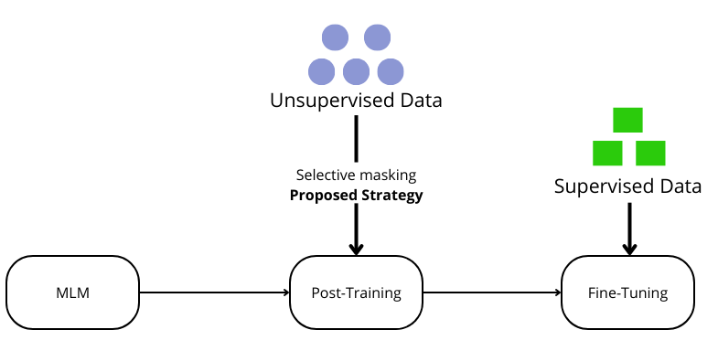
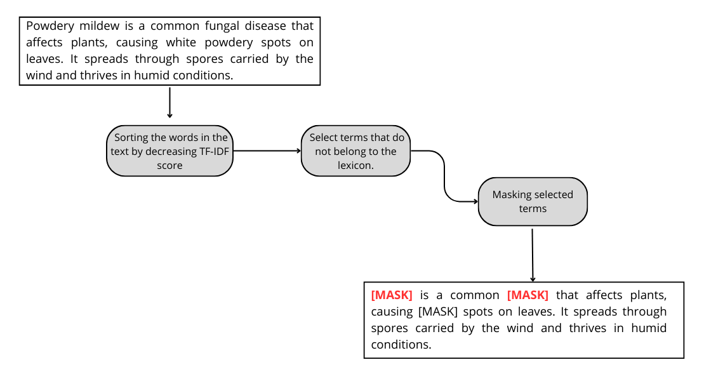
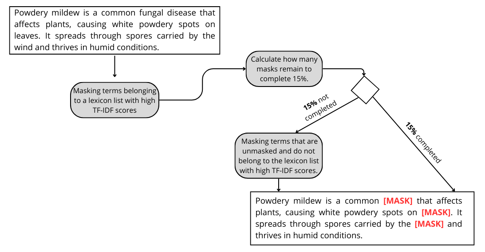

# enhanced-lm-masking-implementation

This repository provides the implementation of the training pipeline introduced in the paper:

***Enhancing Language Models with Selective Masking for Thematic and Misinformation Classification in a One Health Context***

## 📄 Abstract

The objective of this paper is to address the scarcity of labeled textual data and improve the performance of language models within a One Health context in two closely related application areas: (i) thematic content in integrated health, covering biomedical, plant health, and syndromic surveillance domains, and (ii) epidemic misinformation, focusing on enhancing epidemiological monitoring. We introduce a training pipeline for language models that consists of two phases. The first phase involves post-training guided by selective masking strategies to adapt the model to a specific domain; for that, we propose two novel masking strategies: SM-Lex-TFIDF, which masks domain lexicon terms with high TF-IDF (Term frequency-Inverse document frequency), and SM-NonLex TFIDF, which masks non-domain lexicon terms with high TF-IDF. The second phase focuses on fine-tuning the model for the classification task using a small amount of labeled textual data. We conducted several experiments to evaluate the performance of our approach using three language models: BERTBase, SciBERT and BioBERT. The results showed significant improvements in the performance of the language models for the classification task in the two targeted areas, even with limited labeled textual data. In addition, we provide a summary that maps each strategy to the context in which it is most effective.

---

## 🧩 Project Structure

    selective-masking-mlm-reproduction/ 
        ├── main.py
        ├── requirements.txt
        ├── README.md
        └── scripts/    
            ├── cleaning.py
            ├── config.py
            ├── data_collator.py
            ├── data_loader.py
            ├── metrics.py
            ├── tfidf_matrix.py
            └── tokenizer_utils.py

---

## 🚀 How to Run

 ### 1. Clone the Repository

    git clone https://github.com/your-username/selective-masking-mlm-reproduction.git
    cd selective-masking-mlm-reproduction

### 2. Install Dependencies
Make sure you have Python 3.8+ installed, then run:

    pip install -r requirements.txt
### 3. Prepare Data

Place your datasets and lexicon files in the appropriate format, and update the paths in `scripts/config.py`:

- `POST_TRAINING_DATA_FILE`
- `FINE_TUNING_DATA_FILE`
- `LEXIC_FILE`
### 4. Prepare Parameters
Set the following parameters in `scripts/config.py`:

    - LABEL_NUM = 2   # Number of labels in the fine-tuning data
    - MODEL_NAME = "bert-base-uncased"   # Name of the language model
    - USED_STRATEGY = 1    # Choose strategy: 1 for strategy 1, 2 for strategy 2
    - MAX_LENGTH_TEXT = 512    # Maximum text length (must be ≤ 512)
### 5. Run the Pipeline

    python main.py

---

## ⚙️Proposed Pipeline and Selective masking strategies:
 
  ### Pipeline

  ### SM-Lex-TFIDF Strategy

  ### SM-NonLex-TFIDF Strategy

## 📊 Results
We evaluated our approach using:

 - **Domains:** Biomedical, Plant Health, Syndromic Surveillance

 - **Models:** `bert-base-uncased`, `allenai/scibert_scivocab_uncased`,`dmis-lab/biobert-base-cased-v1.1`

Results showed consistent improvements in classification accuracy across all tested domains and models.

## 📁 Citation
If you use this code, please cite the original paper:

***Enhancing Language Models for Specialized Classification Tasks Using Selective Masking Strategies.***

## 📬 Contact
If you have any questions, encounter issues with the code, or would like to know more about our work, please contact the corresponding author:

📧 Personal email (permanent): ysfmh2002@gmail.com

📧 Professional email (not sure if permanent): mahdoubi.youssef@usms.ma
